# Testing de interacción — 10 de septiembre de 2026

La base automatizada pasa, pero el recorrido de interfaz detectó pérdida de texto y barreras de navegación que esas pruebas no cubren. Prioridad: proteger la edición de notas y conservar información de guardado y nombres accesibles en pantallas pequeñas.

## Alcance y entorno

- Rama `codex/003-reference-library-reuse`, base `d30c0f3`; workspace inicialmente limpio.
- Auditoría exploratoria mediante navegador integrado de Codex, DOM, árbol de accesibilidad, capturas y contraste con código. No es un estudio con participantes.
- Build local conectado: puerto 3000. Acceso y errores públicos comprobados sin iniciar sesión.
- Demo nativa del repositorio: puerto 3001, variables públicas de Supabase vacías sólo en el proceso. Interacciones del lienzo con persistencia local, sin mutaciones remotas.
- Pantallas: 390 × 844, 768 × 1024, 1280 × 720 y 1440 × 900. Los hallazgos comunes al componente requieren confirmación adicional en una sesión autenticada.
- Se dejó una nota de QA únicamente en el almacenamiento local de la demo: `QA interacción 2026-09-10`. No se modificó código de producto ni se publicó.

## Validaciones ejecutadas

| Comprobación | Resultado actual |
|---|---|
| `npm run test:backend` | TypeScript y ESLint aprobados; 40/40 pruebas backend/frontend |
| `npm run build` | Aprobado, Next.js 16.2.12 |
| `TEST_BASE_URL=http://localhost:3000 npm run test:integration` | 3/3 aprobadas |
| Misma suite con `127.0.0.1` | 2/3: callback devuelve `localhost`; discrepancia de origen local, no redirección al destino externo |
| Consola de la demo consultada al terminar | Sin entradas de error o advertencia devueltas |
| `git diff --check` | Aprobado |
| Persistencia de nota después de salir con Tab | Aprobada tras recarga |
| Persistencia de nota sin salir del campo | Falló dos veces: vuelve al contenido anterior |
| Escape en retirada de imagen | Cierra y devuelve foco al botón que abrió el diálogo |
| Ancho del documento | Sin desborde global en 390, 768 y 1440 px; lienzo desplazable intencional |

Los primeros intentos de servidor y HTTP fueron bloqueados por `EPERM` del sandbox. Se repitieron con permiso de ejecución local. El navegador sufrió un timeout al navegar por `localhost`; la ruta directa con `127.0.0.1` permitió continuar. El servidor conectado también registró `AuthRetryableFetchError: fetch failed`, por lo que la autenticación remota no se considera validada. Estos incidentes se separan de los defectos de interacción.

## Recorrido y evidencia

1. **Acceso — parcial, interfaz correcta.** Formulario con etiqueta de correo y acción principal identificable. No se solicitó correo de acceso. [Captura 01](01-acceso.png).
2. **Abrir lienzo y crear nota — funciona con fricción.** La nota aparece sobre contenido previo y el foco permanece en el botón Nota. [Capturas 02](02-tablero.png) y [03](03-nota-creada.png).
3. **Editar y recargar — fallo.** El texto escrito mientras el campo conserva foco se pierde; salir con Tab sí lo guarda. [Antes, 04](04-nota-sin-guardar.png), [después, 05](05-nota-perdida.png), [control positivo, 13](13-escritorio.png).
4. **Buscar una tarjeta — parcial.** Buscar `Óptica` devuelve el resultado y le entrega foco, pero a 1280 px permanece cortado a la derecha. [Búsqueda, 06](06-busqueda.png) y [destino, 07](07-busqueda-destino.png).
5. **Abrir retirada y cancelar — correcto dentro del alcance.** Distingue los dos alcances y Escape restaura el foco. El borrado remoto está deshabilitado en demo; no se ejecutó ninguna retirada. [Captura 08](08-retirar-imagen.png).
6. **Móvil y tablet — necesita mejoras.** La barra móvil ofrece secciones, pero no búsqueda ni selector de proyecto/tablero. En tablet los cuatro botones de sección carecen de nombre accesible. El estado de guardado está oculto en ambos tamaños. [Móvil, 09](09-movil.png), [ajuste, 10](10-movil-ajustado.png), [tablet, 12](12-tablet.png), [árbol accesible](tablet-accessibility.txt).
7. **Referencias — bloqueado por modo local.** La navegación muestra explícitamente que necesita Supabase. No valida miniaturas, reinserción ni usos reales. [Captura 11](11-referencias-local.png).
8. **Recuperar enlaces inválidos — correcto en los estados probados.** Acceso expirado explica cómo solicitar otro enlace; share inválido muestra estado final y vuelta al inicio. [Acceso, 14](14-acceso-expirado.png) y [share, 15](15-enlace-invalido.png).

## Mejoras priorizadas

### UX-01 · P1 · Pérdida silenciosa del borrador de una nota

**Reproducir:** crear nota, editar contenido, mantener foco en el textarea y recargar. El título que ya perdió foco persiste, pero el contenido vuelve al anterior. Se repitió tras una pausa prolongada: no es sólo el debounce de guardado. Al editar, pulsar Tab y recargar, sí persiste.

**Causa confirmada:** `components/board/BoardCard.tsx:249` y `:250` mantienen cambios en estado del componente y sólo llaman `updateCardText` en `onBlur`. El guardado del proveedor no recibe el borrador durante la escritura. La demo reproduce el problema; el componente es compartido con el modo remoto.

**Mejora:** incorporar el borrador al flujo de guardado durante la edición y representar claramente los cambios pendientes, conservando las operaciones versionadas del backend.

**Aceptación:** editar título y contenido, esperar confirmación de guardado sin cambiar foco y recargar conserva ambos; navegar o cerrar con cambios pendientes tiene una recuperación definida. Probar también offline y conflicto antes de aprobar el flujo remoto.

### UX-02 · P1 · El estado de guardado desaparece en móvil y tablet

**Reproducir:** comparar el tablero a 1280, 768 y 390 px. `Solo en este equipo` está visible en escritorio y desaparece en tamaños pequeños; el DOM confirma `display: none`.

**Causa:** `app/globals.css:1357` oculta `.save-state` por debajo de 900 px. Es la misma región de estado usada en modo remoto. No se simuló un error remoto: su impacto durante fallos de red sigue pendiente de prueba autenticada.

**Mejora:** mantener un estado compacto visible y accesible; presentar errores y acciones de recuperación sin depender de un tooltip.

**Aceptación:** carga, guardando, guardado, error y sin conexión se pueden percibir a 390 y 768 px, con anuncio accesible cuando corresponda.

### UX-03 · P2 · Cuatro botones sin nombre accesible en tablet

**Reproducir:** a 768 px inspeccionar la navegación: los botones de Tableros, Referencias, Equipo y Actividad aparecen sólo como `button` en el árbol accesible.

**Causa:** `app/globals.css:1332` oculta `.nav-item span` y `components/board/Sidebar.tsx:205` depende de ese texto, sin `aria-label` alternativo.

**Mejora:** conservar un nombre accesible independiente del texto visible y proporcionar ayuda visual para los iconos.

**Aceptación:** los cuatro controles mantienen nombres inequívocos en el árbol de accesibilidad en todos los tamaños; verificar el recorrido con lector de pantalla. Riesgo de accesibilidad confirmado en semántica, sin declarar una auditoría WCAG completa.

### UX-04 · P2 · “Ajustar tablero” no ajusta al espacio disponible

**Reproducir:** a 390 px pulsar Ajustar tablero. Sigue en 82%, con la primera sección parcialmente visible y las siguientes fuera de pantalla.

**Causa:** `components/board/BoardCanvas.tsx:94` fija `actions.setZoom(0.82)` sin calcular dimensiones. `BoardProvider.tsx:603` además limita el mínimo a 50%.

**Mejora:** calcular escala y posición según el contenido y el viewport, o definir una acción explícita de ajustar sección cuando el tablero completo sea ilegible.

**Aceptación:** la acción muestra el alcance anunciado en móvil y escritorio y permite volver a una escala de edición legible.

### UX-05 · P2 · Navegación móvil incompleta

**Reproducir:** a 390 px desaparecen Buscar y el selector lateral de proyecto/tablero. La navegación inferior recupera las secciones, pero no esos controles.

**Causa:** `app/globals.css:1373` oculta la sidebar y `:1387` oculta los botones de cabecera; posteriormente sólo restituye comentarios y notificaciones.

**Mejora:** ofrecer búsqueda y cambio de proyecto/tablero mediante un menú móvil identificable.

**Aceptación:** completar desde móvil el cambio de proyecto, cambio de tablero y localización de una referencia. La prueba real entre dos tableros requiere una sesión autenticada.

### UX-06 · P2 · El resultado de búsqueda no queda completamente visible

**Reproducir:** a 1280 px buscar Óptica y pulsar el resultado. El artículo recibe foco, pero su rectángulo queda entre x=1166 y x=1339; la pantalla termina en x=1280. La tarjeta sigue cortada y resulta difícil identificar el destino.

**Causa:** `components/board/WorkspacePanels.tsx:303` sólo llama `.focus()` después de cerrar el panel, sin asegurar el encuadre completo.

**Mejora:** desplazar el lienzo hasta la tarjeta y resaltarla temporalmente, respetando preferencias de movimiento reducido. Abrir la búsqueda debería enfocar el campo, que actualmente cede el foco al botón Cerrar por el efecto del drawer.

**Aceptación:** buscar una tarjeta fuera de vista la coloca completamente visible, o ajustada si excede el viewport, con foco inequívoco y sin alterar su posición en el tablero.

### UX-07 · P3 · Objetivos pequeños y creación de notas poco guiada

**Evidencia:** a zoom 82%, comentar/retirar mide aproximadamente 22 × 22 px y redimensionar 9 × 9 px. La nota nueva se superpone a la primera imagen y no recibe foco. No se probó precisión táctil en un dispositivo físico, por lo que ésta es una oportunidad de usabilidad sustentada por geometría y captura, no una tasa de error medida.

**Mejora:** ampliar las áreas táctiles sin escalarlas con el contenido y enfocar el título de la nota recién creada en una posición visible.

**Aceptación:** controles cómodos en un recorrido táctil real; crear nota permite escribir inmediatamente y reconocer dónde apareció.

## Siguiente ciclo de validación

1. Corregir UX-01 y añadir regresión E2E con recarga sin blur y control positivo con Tab.
2. Corregir UX-02/03 y verificar estados y nombres accesibles en 390/768 px.
3. Abordar ajuste, navegación y búsqueda; validar alcance visible y foco en los cuatro tamaños.
4. Ejecutar M003-E con sesiones separadas de owner/editor/viewer, dos tableros y una referencia de prueba; cortar/restaurar red durante firmado y reinserción, y provocar conflicto de versión.
5. Repetir suites y smoke autenticado. Este informe no cierra M003-E ni autoriza publicación.

No se validaron en este ciclo: login por correo completo, creación remota de proyectos/tableros, uploads, comentarios reales, invitaciones, colaboración simultánea, permisos efectivos, firmado privado ni red offline. No se emitieron correos ni se crearon enlaces compartidos. Las pruebas TypeScript existentes cubren parte de la lógica de estos flujos, pero no sustituyen su ejecución E2E.

## Capturas del recorrido

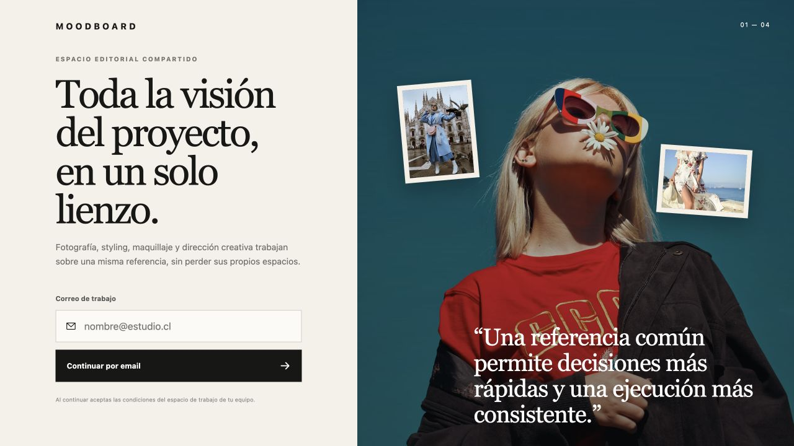

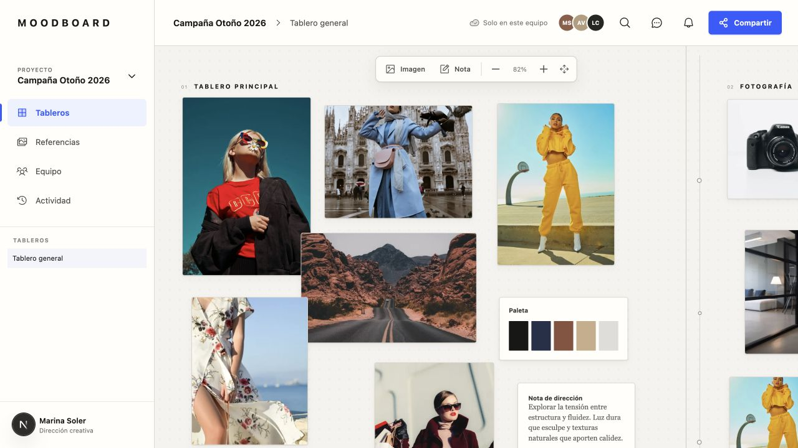

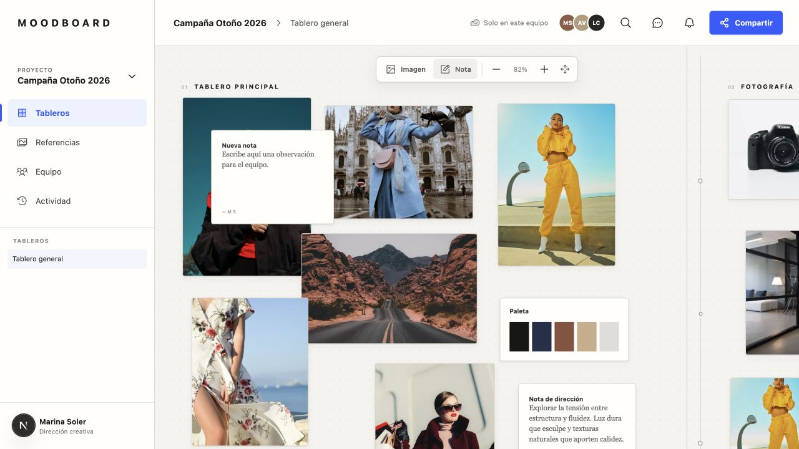

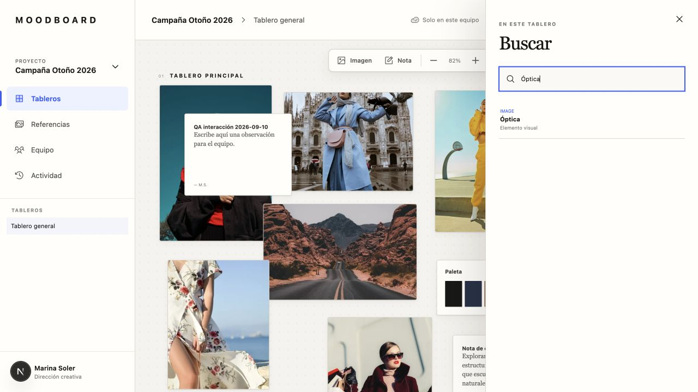

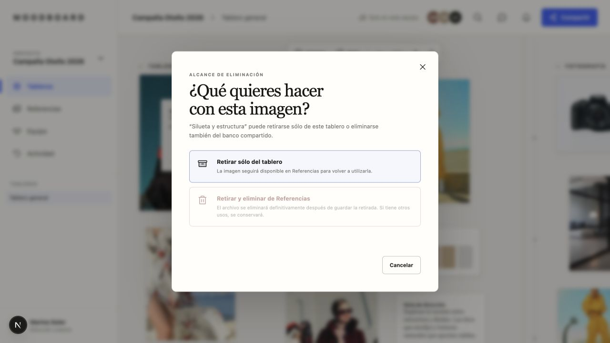

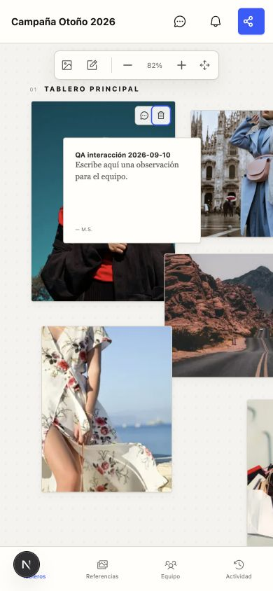

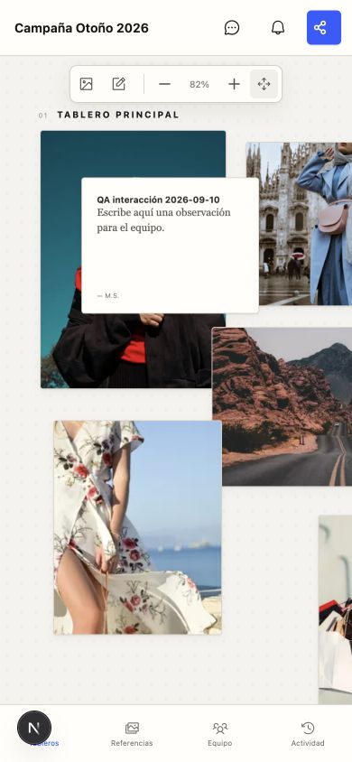

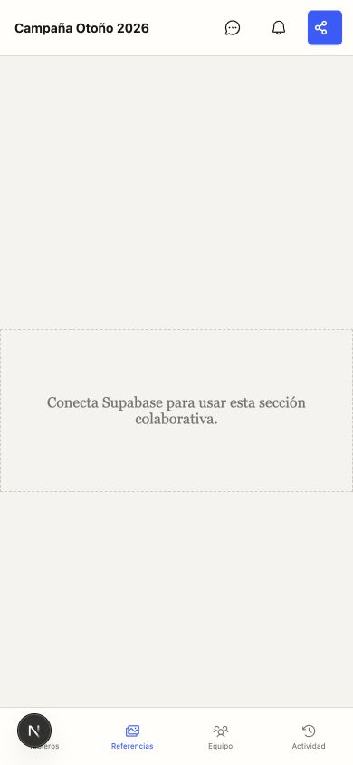

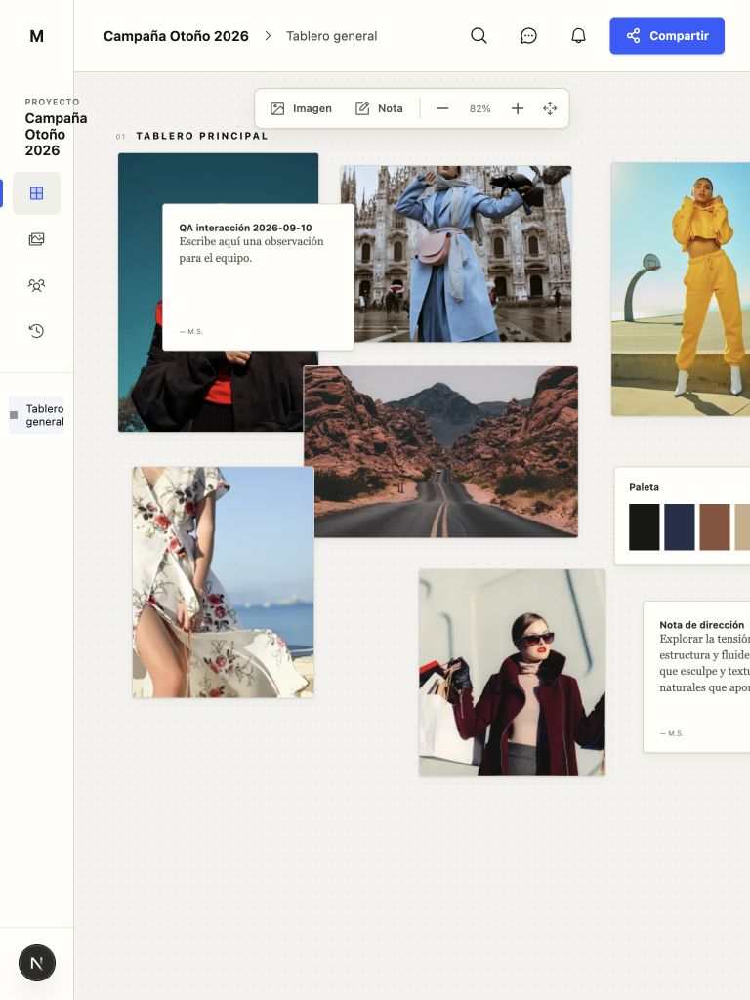

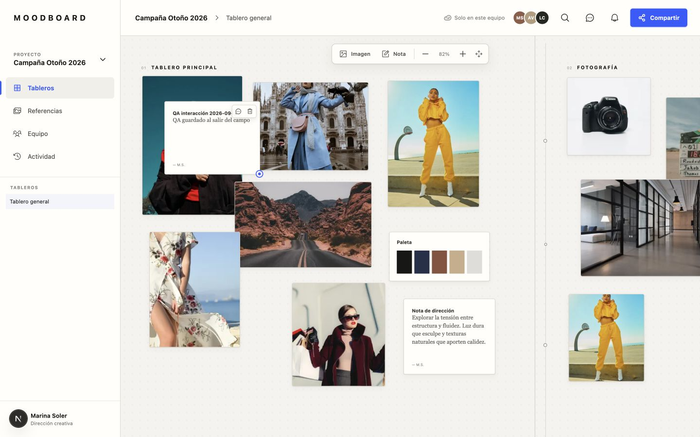

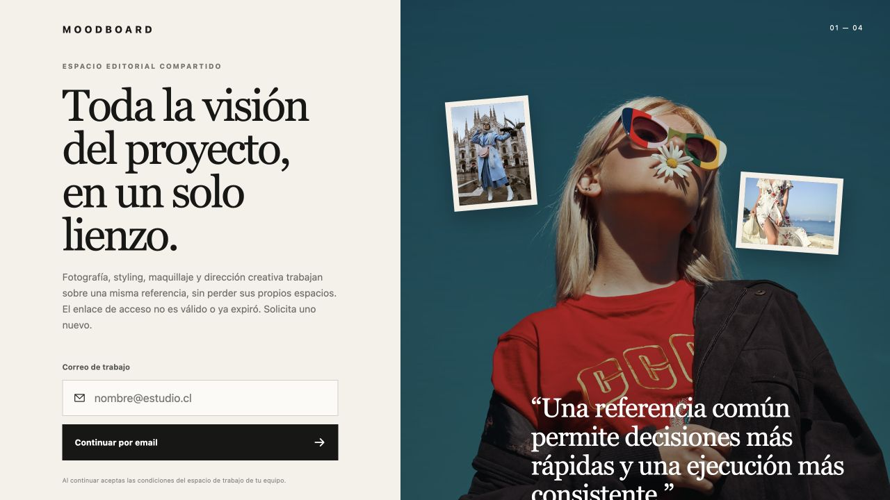

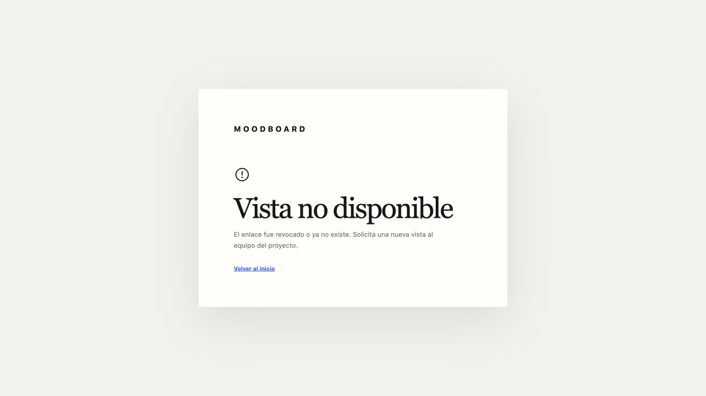

