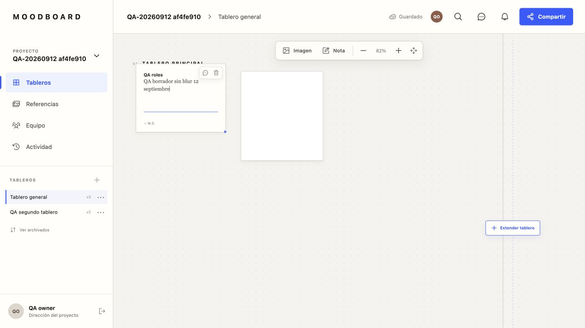
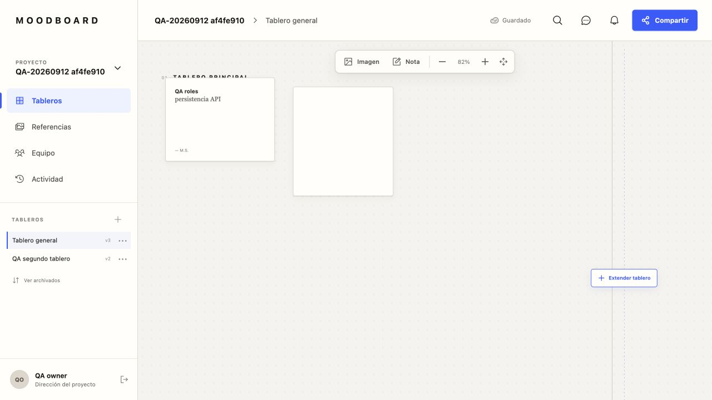
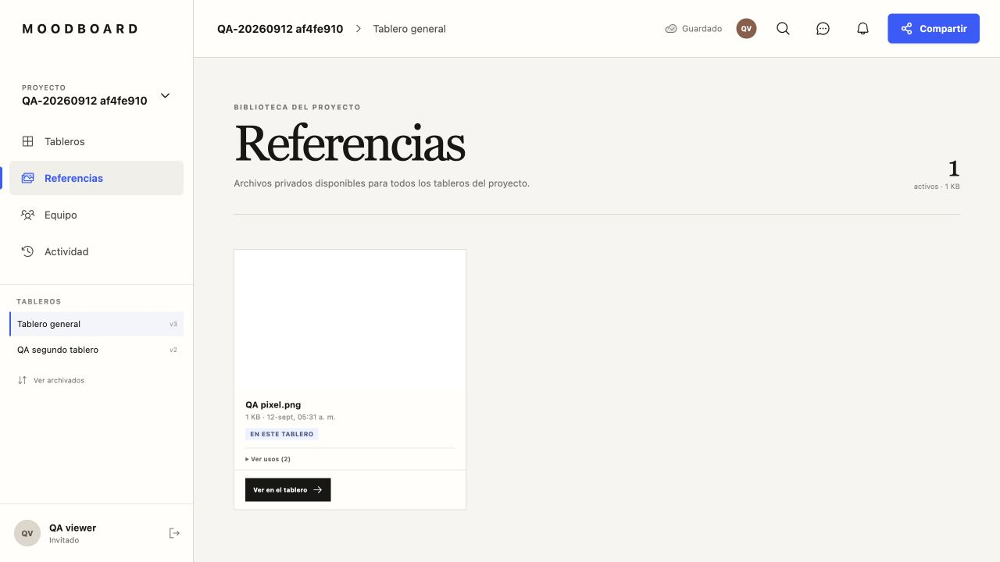
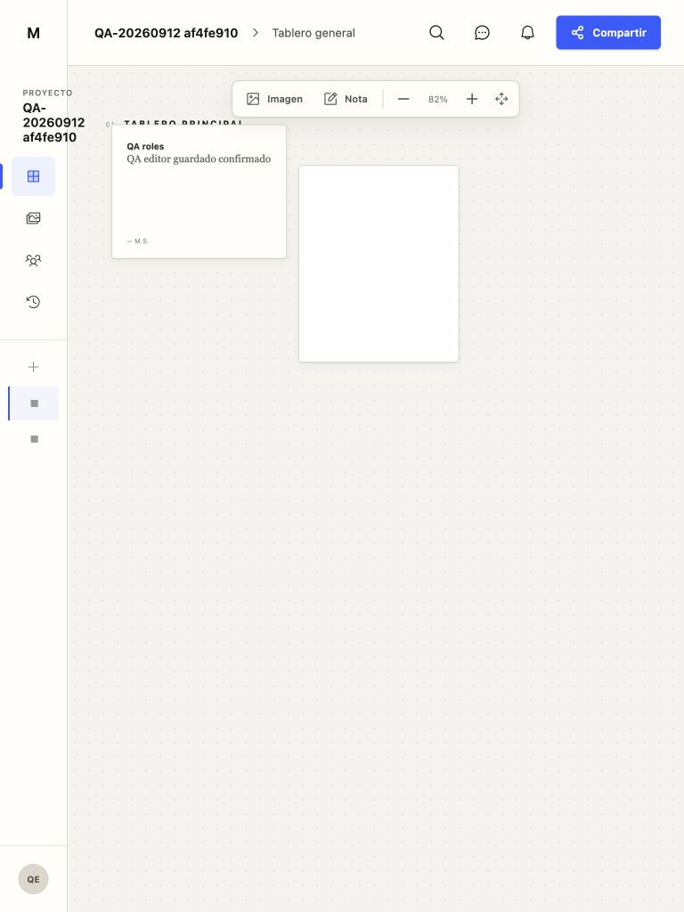
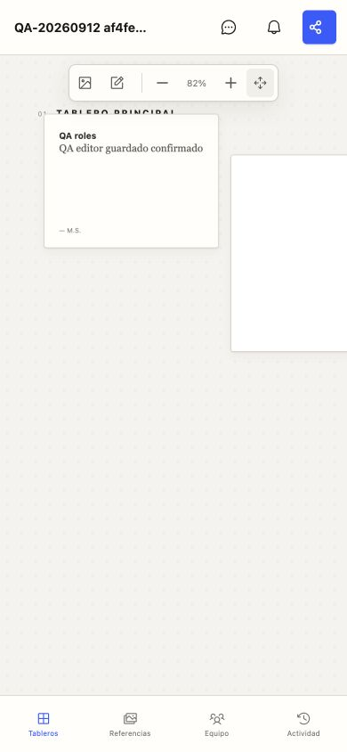
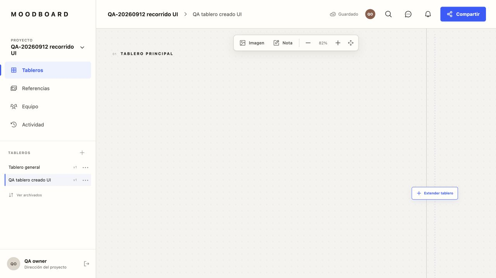
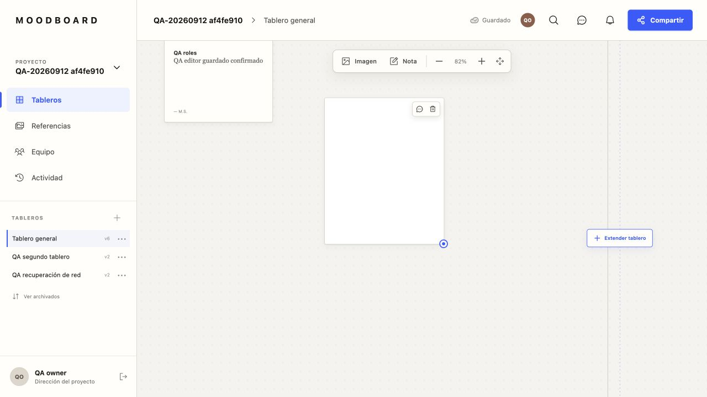

# Ciclo de testing — 12 de septiembre de 2026

**Resultado: regresiones automáticas aprobadas; cierre de UX y publicación no aprobados.** La pérdida de borradores se reproduce ahora con Supabase real. La actualización de dependencias no incluía correcciones de los hallazgos del 10 de septiembre.

## Base examinada

- Rama `codex/003-reference-library-reuse`, commit `df04e51`; árbol inicialmente limpio.
- Cambios desde `d30c0f3`: actualización de dependencias y documentación de QA, sin modificaciones de componentes.
- Versiones instaladas: Next.js 16.3.5 y Sharp 0.35.4.
- Build de producción servido localmente en puerto 3000 contra el Supabase configurado.
- Cuentas owner/editor/viewer creadas con autorización explícita del usuario. Las pruebas de dominio usaron sesiones de usuario y RPC; la clave administrativa sólo creó cuentas.
- Ninguna migración, push, merge o publicación ejecutada. La demo fue detenida; el build local del puerto 3000 se reabrió y queda disponible para continuar la prueba del enlace pendiente.

## Resultados

### Plan solicitado por el usuario: ejecución ampliada

| Paso | Resultado |
|---|---|
| Solicitar y abrir enlace de acceso | Solicitud enviada desde el formulario al correo autorizado; la interfaz confirmó envío. Falta recibir el enlace y abrirlo. No se considera validada la entrega ni el callback real. |
| 1. Crear proyecto y tablero | Aprobado desde la UI: `QA-20260912 recorrido UI`, tablero inicial automático y `QA tablero creado UI`. El formulario vacío bloquea Guardar. |
| 2. Cambiar entre proyectos | Aprobado en ambos sentidos entre los dos proyectos QA. Nombre y lista de tableros corresponden al proyecto elegido. |
| 3. Mover, redimensionar y eliminar imágenes | Arrastre, redimensionado por teclado y arrastre aprobados; geometría persistida tras recarga. Retirada sólo del tablero aprobada previamente con editor. No se ejecutó borrado irreversible del archivo. |
| 4. Referencias y reinserción | Aprobado con editor; conserva la referencia al retirar, reinserta, enfoca y persiste sin duplicados. Viewer conserva consulta. |
| 5. Roles editor/viewer e interrupción de red | Roles aprobados por RPC y UI. Seis pruebas de fallo y recuperación de transporte aprobadas. Offline visual del navegador pendiente. |

Evidencia ampliada: `plan-user.json`, `08-proyecto-tablero.png` y `09-imagen-movida.png`.

Geometría inicial de la imagen: x=316, y=136, ancho=220 y alto=270. Tras mover: x=413.56, y=209.17. Tras redimensionar con teclado y arrastre: ancho=264.78, alto=324.96. Estos cuatro valores se conservaron exactamente después de recargar y completar la carga remota.

El segundo proyecto QA añade dos tableros vacíos a los datos conservados. El entorno contiene ahora dos proyectos QA creados en esta sesión y cinco tableros en total. El primero conserva la imagen sintética y las tarjetas de ensayo.

| Capa | Resultado | Evidencia |
|---|---|---|
| TypeScript + ESLint + unitarias | Aprobado, 40/40 | `unit.log` |
| Build de producción | Aprobado | `build.log` |
| HTTP con `localhost:3000` | Aprobado, 3/3 | `http.log` |
| Auditoría de producción | 0 vulnerabilidades informadas | `audit.json` |
| Integración remota con tres roles | Aprobado, 17/17 comprobaciones | `remote.json` |
| Fallo y recuperación de transporte | Aprobado, 6/6 comprobaciones | `network.json` |
| Interacción autenticada | Mixto: permisos/reinserción correctos, fallos UX abiertos | `browser-results.json`, capturas |

Las 17 comprobaciones remotas incluyen login de tres cuentas, aceptación de invitaciones internas sin envío de correo, lectura por rol, escritura de editor, reintento idempotente, denegación de escritura de viewer, conflicto de versión, reutilización en dos tableros, duplicados rechazados, activo en uso protegido, descarga de miniatura privada y denegación de comentarios al viewer sin permiso.

Las 6 pruebas de transporte inyectaron un rechazo de `fetch` en un cliente Supabase: fallo y recuperación del firmado, fallo de reinserción sin cambio de versión, recuperación idempotente y una sola tarjeta persistida. **No equivalen a activar offline en el navegador ni prueban sus avisos visuales.**

## Recorridos autenticados

1. **Owner: acceso y biblioteca aprobados.** Sesión QA real, proyecto aislado, una referencia privada y dos usos visibles. [Captura](03-owner-referencias.png).
2. **Owner: borrador fallido.** Escribir `QA borrador sin blur 12 septiembre` manteniendo foco deja el estado `Guardado`. Recargar restaura `persistencia API`. Confirma UX-01 en entorno remoto. [Antes](01-owner-borrador.png), [después](02-owner-recarga.png).
3. **Viewer: permisos aprobados en interfaz.** Imagen/Nota/Extender están deshabilitados. No hay eliminación ni edición de texto. Comentarios explican que puede leer, pero no publicar. Referencias conserva miniatura y navegación, sin borrado. [Árbol](viewer.txt), [captura](04-viewer-referencias.png).
4. **Editor: edición aprobada al salir del campo.** Escribir `QA editor guardado confirmado`, pulsar Tab y esperar permite conservar el texto tras recarga.
5. **Editor: retirada y reinserción aprobadas.** Retirar sólo del tablero confirma conservación de la referencia; la biblioteca muestra un uso restante y permite Añadir al tablero. Reinserta, enfoca la tarjeta y conserva exactamente una tarjeta después de recargar. [Captura](05-editor-reinsertar.png).
6. **Tablet 768 × 1024: fallos vigentes.** Cuatro botones de navegación sin nombre accesible; los botones de ambos tableros se anuncian sólo como `▦`. Estado de guardado oculto. Sin desborde horizontal global. [Árbol](tablet.txt), [captura](06-tablet.png).
7. **Móvil 390 × 844: fallos vigentes.** Estado de guardado y búsqueda ocultos; no hay cambio de proyecto/tablero. Ajustar tablero mantiene 82%. Sin desborde horizontal global, pero el contenido del lienzo sigue parcialmente fuera de vista. [Captura](07-movil.png).

El navegador integrado usó las tres sesiones secuencialmente, con cierre de sesión entre roles; no fueron tres perfiles concurrentes. Consola consultada: 0 errores y 0 advertencias devueltos durante el recorrido inicial. En la ampliación se solicitó el correo de acceso desde la interfaz; entrega y apertura siguen pendientes.

## Hallazgos y decisión

- **P1 UX-01:** pérdida de borrador sin blur confirmada con Supabase. El componente sólo propaga cambios en `onBlur`; mientras se escribe, puede mostrar `Guardado` aunque el borrador no esté persistido.
- **P1 UX-02:** `.save-state` continúa oculta bajo 900 px. El usuario móvil no ve el estado de persistencia.
- **P2 UX-03:** nombres accesibles ausentes en navegación tablet. Se amplía la evidencia a los selectores de tableros reales.
- **P2 UX-04/05:** ajuste fijo a 82% y navegación móvil incompleta confirmados.
- **UX-06/07:** conservan el informe del 10 de septiembre; no se repitió la búsqueda de una tarjeta lejana ni la precisión táctil en este ciclo.

No se detectó una nueva regresión atribuible a la actualización de dependencias dentro del alcance probado. Esto no permite cerrar UX: los dos P1 siguen abiertos.

**Siguiente paso:** corregir UX-01/02/03, repetir sus recorridos y completar M003-E con offline real del navegador y dos usuarios editando simultáneamente. El rechazo de versiones atrasadas sí está probado por RPC, pero no la recuperación visual simultánea. También faltan expiración visual de URLs firmadas y smoke de preview.

## Datos QA y acceso

Se conservan tres cuentas QA y el proyecto `QA-20260912 af4fe910`, con tres tableros, una imagen PNG sintética de 1 píxel y tarjetas de prueba. Están en el Supabase configurado, no en una base efímera. No se tocaron proyectos preexistentes. Los IDs y correos sintéticos están en `remote.json`; el tercer tablero está en `network.json`.

Las contraseñas aleatorias y sesiones se guardaron únicamente en `/tmp/moodboard-qa-20260912/state.json`, con permisos 0600 dentro de un directorio 0700. No están en el repositorio ni en este informe. Es un archivo temporal, no un mecanismo permanente de entrega de credenciales. Las cuentas permiten repetir QA mediante nuevas sesiones administrativas autorizadas.

## Capturas

